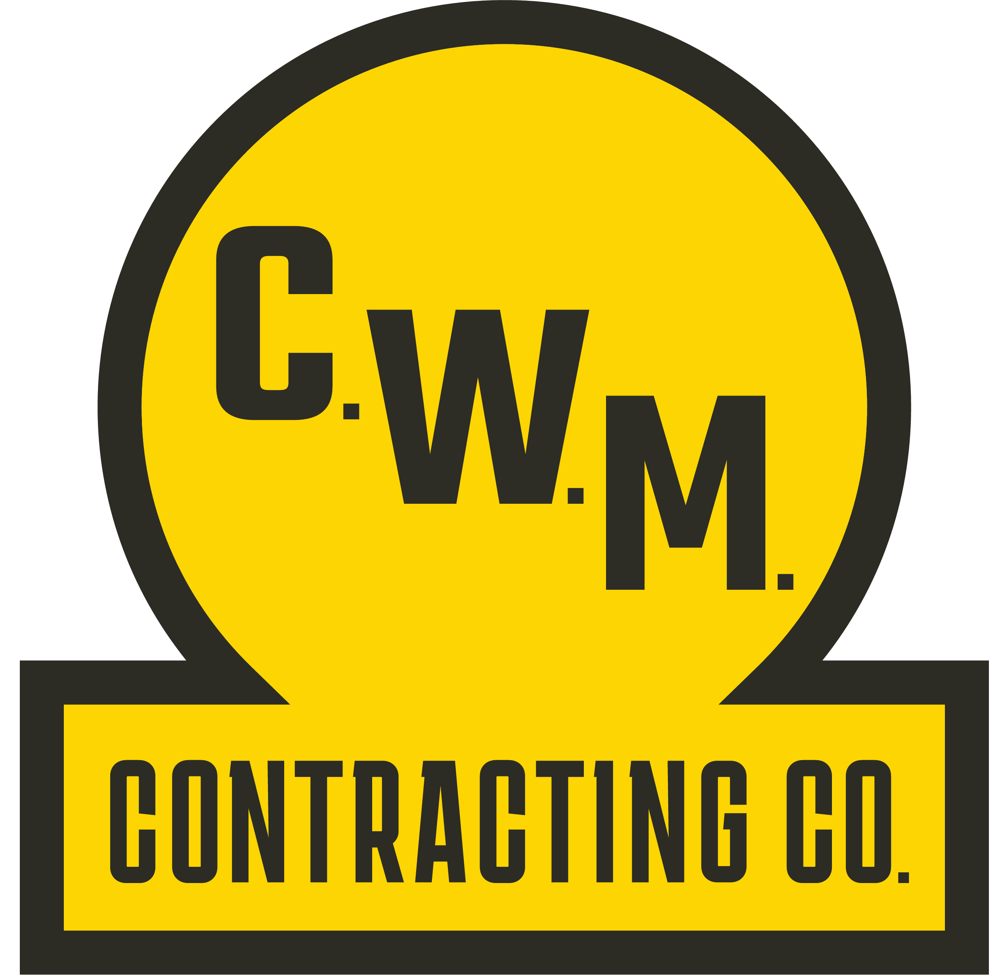

# 🧭 Personal Development Plan (PDP) App  
*A modern, theme-aware, Firebase-powered personal development tracker.*

## 📌 Overview  
The **Personal Development Plan (PDP) App** is a modern, web-based system designed to help individuals track their personal and professional development through structured **Goals → Sub-goals → Tasks**.

It is built using:

- **Vanilla JavaScript, HTML, CSS**
- **Firebase Authentication + Firestore**
- A fully responsive, animated UI
- A custom **3-theme system** (Light, Dark, and CWM company-branded theme)
- A powerful **Dashboard** and **Calendar view**
- Drag-and-drop reordering of goals, sub-goals, and tasks
- Multi-user support (each user only sees their own PDP)
- Hosted on **GitHub Pages**

This app is designed as a long-term personal and professional growth tracker, with flexibility for future expansion.

---

## ✨ Key Features

### ✅ Full PDP Structure  
- Create and manage **Goals**
- Break goals down into **Sub-goals**
- Add actionable **Tasks** under each sub-goal  
- Track timelines with **Projected Start/End Dates**
- Progress rolls up automatically:
  - Tasks → Sub-goals  
  - Sub-goals → Goals  
  - Goals → Overall dashboard metrics  

---

### 🗓️ Calendar View  
A built-in calendar shows:

- Goal timelines (mini-Gantt bars)
- Sub-goal timelines
- Task due dates
- Click any event to open edit modal

Theme-aware, responsive, and intuitive.

---

### 📊 Dashboard Insights  
The dashboard includes:

- Quick overview of all professional and personal goals  
- Overall PDP progress  
- **Current Focus Goal**  
- **Tasks Due Soon**  
- **At-Risk Items**  
- **Recently Updated Activity Feed**  

Together, these provide an instant snapshot of the user's development progress.

---

### 🎨 Advanced Theme System  
The theme toggle cycles through:

- **🌞 Light mode** (clean modern colors)  
- **🌙 Dark mode** (deep slate UI)  
- **🏗️ CWM Theme**  
  - Uses company brand colors  
  - Neutral dark backgrounds  
  - CWM brand yellow accents  
  - CWM logo used as the theme icon  
  - Optional background logo watermark  

A palette picker gives users additional color customization options.

---

### 🔄 Drag-and-drop  
All major structures support custom ordering:

- Rearrange Goals  
- Rearrange Sub-goals within each Goal  
- Rearrange Tasks within each Sub-goal  

Reorders are saved to Firestore using `orderIndex`.

---

### 🔐 Firebase-Powered Authentication  
- Secure user login (email/password, expandable to OAuth)
- Per-user Firestore storage  
- Real-time syncing  

---

### 🧱 Clean, Modular Code Structure  
- `main.js` handles logic, rendering, and Firestore interaction  
- `styles.css` defines theme-aware styling and layout  
- `index.html` provides semantic structure  
- Code designed for easy extension using VS Code Copilot and clear developer specs  

---

## 🗂️ Project Structure

- personal-dev-plan/
- ├── index.html
- ├── main.js
- ├── styles.css
- ├── assets/
- │ ├── cwm-logo.png
- │ ├── cwm-logo-icon.ico
- │ └── other assets…
- └── dev-notes/
- ├── PDP_MASTER_SPEC.md
- ├── DASHBOARD_UPGRADE_SPEC.md
- └── QUOTE_BANNER_SPEC.md

---

## 🚀 Getting Started (Local Development)

You can run the PDP app locally using a lightweight static server.

### 1. Install a simple local server  
If needed:

bash
npm install -g serve

### 2. Start the server
bash
npx http-server
#### Visit:
http://localhost:3000

---

## 🔧 Firebase Setup

This app requires:
- A Firebase project
- Authentication enabled
- Firestore Database enddabled

Update your Firebase config in main.js:
 const firebaseConfig = {
  apiKey: "...",
  authDomain: "...",
  projectId: "...",
  storageBucket: "...",
  messagingSenderId: "...",
  appId: "..."
};

Firestore rules should restric reads/writes to authenticated users.

---

## 🌐 Deployment (GitHub Pages)
1. Push your code to a public GitHub repo
2. Go to Settings -> Pages
3. Select:
    - Branch: main
    - Folder: /root
4. Save

Your app will be hosted at:

https://<username>.github.io/personal-dev-plan/

---

## 🛣️ Roadmap
### 🔔 Reminders & Notifications
- Task due today notifications
- Weekly PDP nudges
- Push notifications via Firebase Cloud Messaging (optional future)

### 📝 Mentorship & Notes Section
- Log VP mentorship sessions
- Record leadership insights
- Reflect on spiritual learning (NMC University)
- Attach notes to goals or sub-goals

### 📎 Attachments
- Upload documents, images, or PDFs
- Associate with goals/sub-goals/tasks

### 🧾 Export Tools
- Generate summary PDF
- Print-friendly PDP view

### 📉 Weekly Progress Tracking
- Store weekly snapshots
- Show progress sparkline

### 🌐 Quote API
- Pull inspirational quotes from external sources
- Rotate daily quotes or refreshing feed

---

## 🧪 Testing
- Mobile resonsive
- Tested in Light/Dark/CWM modes
- CRUD for goals, sub-goals, tasks
- Firestore access validated
- Calendar event positioning verified

---

## 🤝 Contributing
Contributions are welcome!
Specs for future features live in the dev-notes folder:
- PDP_MASTER_SPEC.md
- DASHBOARD_UPGRADE_SPEC.md
- QUOTE_BANNER_SPEC.md
Feel free to submit feature requests or enhancements

---

## 👤 Author
### Drew Coffey
Personal Development Plan Web Application
Built with ChatGPT + VSCode + GitHub Copilot
Focused on leadership development, personal growth, and coaching.

---

## ⭐ License
This projece is licensed under the MIT License--free to use, modify, and extend.
